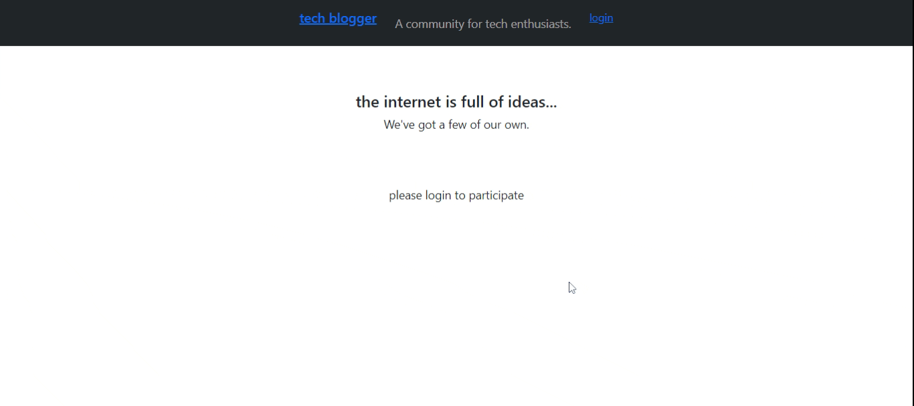

# Tech Blogger

## Description of Project
Looking for a site to host and post tech-related blogs?  Look no further.  This project is a full stack, Node.js application that uses MySQL and Handlebars to display and edit a blog posts from a multitude of users across the interweb.   

Head over to the site deployed on Heroku [here!](https://gentle-stream-70755.herokuapp.com/)

Read below for further details.  Enjoy!

## Table of Contents

- [Credits and Code Used](#credits-and-code-used)
- [Application Demo](#application-demo)
- [Questions](#questions)
- [Takeaways and Future Development](#takeaways-and-future-development)

## Credits and Code Used

- JavaScript/ES6
- Handlebars for HTML/CSS
- Node.js
- MySQL, JawsDB
- npm packages (express, mysql, sequelize, bcrypt, express-session, handlebars)

## Application Demo

## Questions
Check out my GitHub profile [here.](https://github.com/smcmillan28)

Feel free to send me an email, as well: smcmillan1991@gmail.com

## Takeaways and Future Development
Using Handlebars as HTML templates allows for easy site navigation and gave access to database tables and information, which was a lot easier than using static HTML and the file system.  Sequelize continues to make MySQL integration into JavaScript applications a whole lot easier.  Steps for future development listed below:

- Adding the ability for users to comment on posts
- Adding the ability for users to delete those comments
- Adding the ability for users to edit their posts
- Adding the ability for users to like/dislike posts (upvote system similar to reddit)
